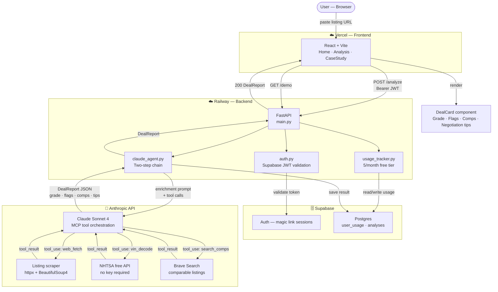

# 🍋 LemonCheck

**AI-powered used car deal analyzer. Paste a listing URL — get a full deal analysis in 30 seconds.**

🔗 **Live app:** [lemon-check.vercel.app](https://lemon-check.vercel.app)
🔗 **Demo mode (no login):** [lemon-check.vercel.app/analysis?demo=true](https://lemon-check.vercel.app/analysis?demo=true)
🔗 **API:** [web-production-7ec3c5.up.railway.app](https://web-production-7ec3c5.up.railway.app/docs)

---

## The Problem

Buying a used car is one of the largest purchases most people make — and most buyers go in blind. Is $18,500 a fair price for a 2019 Civic with 62k miles? Is that "clean Carfax" actually clean? What's the real negotiating leverage here?

Answering those questions used to require hours of research: scanning comparable listings, cross-referencing mileage, knowing which trim has the CVT recall, understanding how to read days-on-market as a negotiation signal. Most buyers skip all of it and just pay the sticker.

LemonCheck does that research in 30 seconds and delivers it as a plain-English verdict.

---

## What It Does

Paste any CarGurus or AutoTrader listing URL (or a VIN). LemonCheck:

1. **Fetches the listing** — extracts year, make, model, trim, mileage, price, location, days on market
2. **Decodes the VIN** — pulls full vehicle specs from the NHTSA free API
3. **Searches comparable listings** — finds 5 similar vehicles for sale nearby
4. **Runs AI analysis** — Claude evaluates the data and produces a structured deal report
5. **Returns a verdict** — letter grade (A–F), price delta vs. market, red flags, green flags, and negotiation talking points

---

## Tech Stack

| Layer | Technology | Why |
|---|---|---|
| **Frontend** | React + Vite | Fast dev experience, excellent Vercel deploy story |
| **Backend** | Python FastAPI | Async-native, type-safe, auto-generates OpenAPI docs |
| **AI Engine** | Claude Sonnet 4 (Anthropic) | Best balance of speed + reasoning for structured output |
| **AI Integration** | MCP (Model Context Protocol) | Mirrors real enterprise AI integration patterns — better portfolio signal than raw API calls |
| **Auth** | Supabase magic link | Zero-friction for users; no password management burden |
| **Database** | Supabase (Postgres) | Usage tracking + analysis archiving; free tier works for portfolio scale |
| **Frontend Deploy** | Vercel | Free, instant, GitHub-connected |
| **Backend Deploy** | Railway | Free tier, Python-native, simple env var management |

---

## Architecture



---

## Local Setup

### Prerequisites

- Node 18+ and npm
- Python 3.11+
- A Supabase project (free tier is fine)
- An Anthropic API key

### 1. Clone and configure

```bash
git clone https://github.com/your-username/lemoncheck.git
cd lemoncheck
cp .env.example .env
# Fill in all values in .env
```

### 2. Apply the Supabase schema

Open the Supabase SQL Editor and run the contents of `docs/supabase-schema.sql`.

### 3. Start the backend

```bash
# From the repo root (not inside /backend)
pip install -r backend/requirements.txt
uvicorn backend.main:app --reload --port 8000
# → API running at http://localhost:8000
# → Swagger docs at http://localhost:8000/docs
```

### 4. Start the frontend

```bash
cd frontend
cp .env.local.example .env.local
# Fill in VITE_SUPABASE_URL, VITE_SUPABASE_ANON_KEY, VITE_API_URL
npm install
npm run dev
# → App running at http://localhost:5173
```

### 5. Seed the demo cache (optional but recommended)

```bash
python scripts/seed_demo.py --url "https://www.cargurus.com/Cars/..."
# → Saves a real analysis to backend/demo_cache.json
# → Powers the GET /demo endpoint and ?demo=true flow
```

### 6. Verify

- Open `http://localhost:5173?demo=true` — should load a full analysis without login
- Open `http://localhost:8000/health` — should return `{"status": "ok"}`
- Open `http://localhost:8000/docs` — Swagger UI with all endpoints

---

## Access Model

| Path | Auth Required | What Happens |
|---|---|---|
| `?demo=true` | No | Returns cached DealReport instantly — designed for recruiters |
| First analysis | Yes (magic link) | Full analysis — email gate shown before result |
| 2–5 analyses/month | Yes | Full analysis — usage count tracked |
| 6+ analyses/month | Yes | 402 response with upgrade prompt |

---

## Repository Structure

```
lemoncheck/
├── README.md                   ← you are here
├── .env.example                ← all required env vars documented
├── docker-compose.yml          ← local dev environment
├── frontend/                   ← React + Vite app (deployed to Vercel)
│   └── src/
│       ├── components/         ← DealCard, SearchInput, LoadingStates, ...
│       ├── pages/              ← Home, Analysis, Login, CaseStudy
│       ├── hooks/              ← useAnalysis, useAuth, useUsageGate
│       └── lib/                ← supabase.js, api.js
├── backend/                    ← FastAPI app (deployed to Railway)
│   ├── main.py                 ← app entry, CORS, routers
│   ├── routers/                ← analysis, auth, demo endpoints
│   ├── services/               ← claude_agent, usage_tracker, cache
│   ├── mcp/                    ← MCP server + web_fetch, vin_decode, search_comps, price_lookup
│   ├── models/                 ← Pydantic: AnalysisRequest, DealReport, User, ...
│   ├── prompts/                ← system_prompt.txt, analysis_schema.json
│   └── tests/                  ← pytest: test_tools, test_agent, test_api
├── docs/                       ← living documentation
│   ├── supabase-schema.sql     ← DB schema (run in Supabase SQL Editor)
│   ├── architecture.md
│   ├── api-reference.md
│   ├── mcp-tools.md
│   ├── prompt-engineering.md
│   └── decisions.md            ← Architecture Decision Records
└── scripts/                    ← seed_demo, test_listings, check_accuracy
```

---

## Why This Exists

The problem it solves is real: most buyers walk into a used car purchase with a gut feeling and a CarGurus listing. The seller has run thousands of deals. LemonCheck levels that playing field.

It's also a demonstration of production-grade AI engineering — MCP tool orchestration, structured output, async FastAPI, and a full deploy pipeline. Read the full breakdown at the [/case-study](https://lemon-check.vercel.app/case-study) route.

Read the full case study (including architectural decisions and what I'd build next) at the `/case-study` route of the live app.

---

## Built By

**Kevin Torres** — [karbonlabs01@gmail.com](mailto:karbonlabs01@gmail.com) · [specsvisuals@gmail.com](mailto:specsvisuals@gmail.com) · [LinkedIn](https://linkedin.com/in/kevinatorres)
